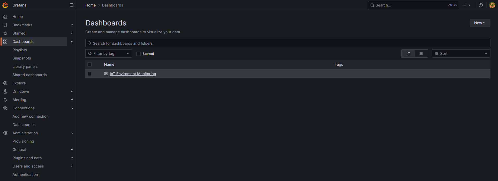
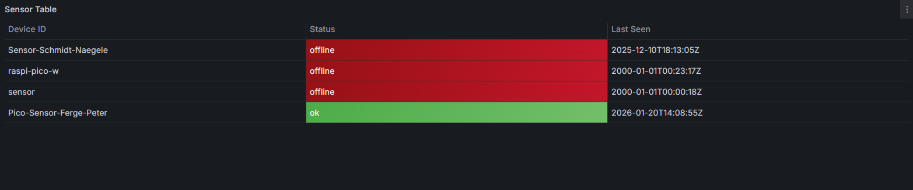
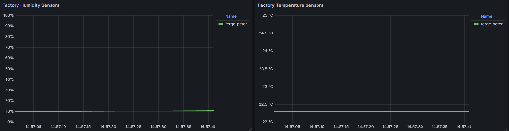
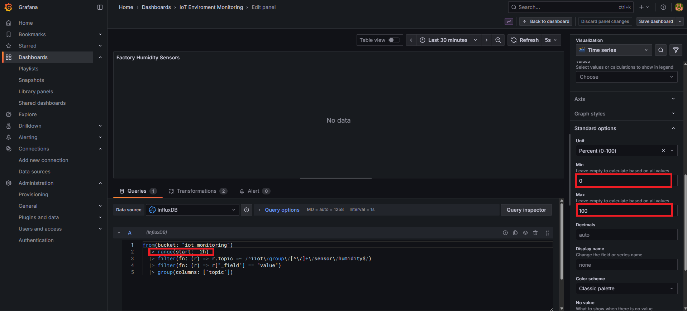

# yourmuesli.at Pico W Monitor

This repo contains the CircuitPython program that runs on a Raspberry Pi Pico W to read one DHT11 sensor and forward temperature/humidity data to the cloud via MQTT. Everything happens inside `src/project/code.py`. Below is a plain-language tour of the important pieces.

## Configuration Flow
- `ConfigManager` only reads `settings.toml` and returns the entries as a Python dictionary. All credentials (Wi-Fi SSID/password, MQTT broker details, reading interval) are pulled from there, so no secrets live inside the code.

## Networking Flow
- `NetworkManager` handles Wi-Fi. Its `connect()` method tries up to five times to join the configured SSID, remembers the socket pool (`socketpool.SocketPool`) for later networking, and can report the IP address if needed.

## Sensor Flow
- `Sensor` wraps the DHT11 that sits on GPIO 22 (`GP22`). Calling `read_data()` returns a dictionary with `temperature` and `humidity` whenever the sensor responds successfully; otherwise it returns `None`. All sensor error handling is centralized here.

## MQTT Flow
- `MqttClient` stores the base topic (default `iiot/test` when nothing is provided) and the Adafruit MiniMQTT client. After `connect()` is called, `publish_telemetry()` will JSON-encode whatever dictionary it receives (e.g., `{"temperature": 23, "humidity": 52, "timestamp": ...}`) and publish it to the configured topic. `loop()` keeps the MQTT connection alive and should be called frequently.

## Main Loop
1. Set up the onboard LED so it can be toggled as a quick status indicator.
2. Load all settings using `ConfigManager`.
3. Connect to Wi-Fi through `NetworkManager`; stop the program early if Wi-Fi cannot be reached.
4. Sync time using NTP (this is optional but ensures timestamps are meaningful).
5. Create the `Sensor` and `MqttClient` objects with the loaded settings.
6. Call `mqtt.loop()` continuously and, every `READING_INTERVAL_SECONDS` (default 30 s), read the sensor:
   - When data is available, add a `timestamp` using `time.time()` and publish through MQTT.
   - When the sensor read fails, print `Sensorfehler` and toggle the LED so you get a visible warning.

## Error Handling
- The entire `main()` call is wrapped in a `try/except`. On any unhandled exception, the Pico prints the error message and performs a `microcontroller.reset()` so it restarts into a clean state.

<br><br>

---

# IoT Monitoring Container

Dieses Repository enthält einen containerisierten IoT-Monitoring-Stack bestehend aus:

- **Telegraf** – Datensammlung (z. B. via MQTT)
- **InfluxDB 2.7** – Zeitreihen-Datenbank
- **Grafana** – Visualisierung

Der gesamte Stack wird über **Docker Compose** gestartet. Dashboard und Datasource werden dabei automatisch für Grafana bereitgestellt.

---

## Projektstruktur

```text
/container
├── grafana/
│   ├── dashboards/
│   │   ├── dashboard.yaml
│   │   └── IoT_Enviroment_Monitoring.json
│   └── datasources/
│       └── datasources.yaml
├── telegraf/
│   └── telegraf.conf
├── docker-compose.yaml
└── README.md
```

---

## Voraussetzungen

- Docker + Docker Compose installiert
- Ports frei:
  - **8086** (InfluxDB)
  - **3000** (Grafana)

---

## Installation und Start

### 1) `.env` erstellen

Die Datei `.env.example` dient als Vorlage. Daraus muss eine `.env` für die Umgebungsvariablen erstellt werden:

```bash
cp .env.example .env
```

> **Hinweis:** Die Datei `.env` sollte **nicht** ins Repository committed werden (enthält Secrets).  

### 2) Variablen in `.env` setzen

Öffne `.env` und ersetze die Platzhalter durch deine Werte:

```text
=== InfluxDB Configuration ===
INFLUXDB_TOKEN=<Your_Superstrong_Token>
INFLUXDB_PASSWORD=<Your_Password>

=== Grafana Configuration ===
GRAFANA_ADMIN_PASSWORD=<Your_Password>

=== Telegraf Configuration ===
TELEGRAF_SERVERS=<Your_Server>
TELEGRAF_CLIENT_ID=<Your_Client_ID>
TELEGRAF_USERNAME=<Your_Username>
TELEGRAF_PASSWORD=<Your_Password>
```

> **Hinweis:** 
> - Das Token für den IoT Bucket kann frei gewählt werden.  
> - Das Grafana-Admin-Passwort kann frei gewählt werden.  
> - Das InfluxDB-Passwort muss zwischen **8 und 72 Zeichen** lang sein.
> - Für die Telegraf Konfiguration müssen die MQTT Server-IP und Logindaten wie auch im `settings.toml` enthalten eingefügt werden

### 3) Stack starten / stoppen

Docker Compose muss im Ordner gestartet werden, in dem die `docker-compose.yaml` liegt.

```bash
docker compose up -d
```

Stoppen:

```bash
docker compose down
```

Stoppen **inkl. Volumes löschen** (setzt Daten zurück):

```bash
docker compose down -v
```

---

## Zugriff

- **InfluxDB:** `http://localhost:8086`
- **Grafana:** `http://localhost:3000`

Grafana Login:
- **User:** `admin`
- **Passwort:** Wert aus `GRAFANA_ADMIN_PASSWORD`

---

## Grafana Dashboard

### Dashboard 
Das Dashboard ist unter `Dashboards` und `IoT Enviroment Monitoring` erreichbar.



### Statusanzeige der Sensoren
Unter `Sensor Table` sind die Geräte, welche verbunden waren aufgelistet. Es wird dargestellt ob diese `Offline` oder `Ok` sind und wann sie sich das letzte mal verbunden haben.



### Anzeige der Temperatur und der Luftfeuchtigkeit
Unter `Factory Humidity Sensors` und `Factory Temperature Sensors` kann man den aktuellen Verlauf der Temperatur und der Luftfeuchtigkeit der jeweiligen Sensoren einsehen.



### Skalieren oder Bearbeiten
Falls eine andere Skalierung der Achsen oder eine Anpassung der Historie notwenig sein sollte geht diese über den Button
Unter `Edit` des jeweiligen Fensters und anschließendes Bearbeiten der im Bild markierten Felder.



---